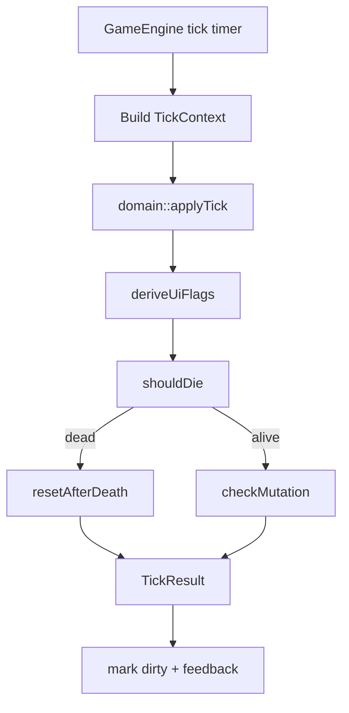
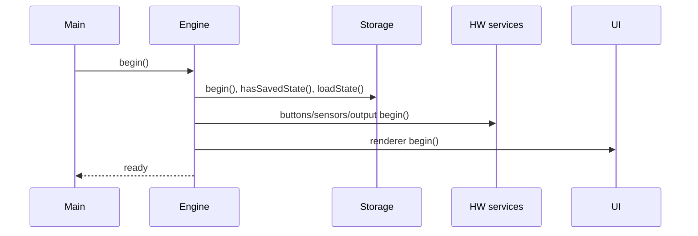
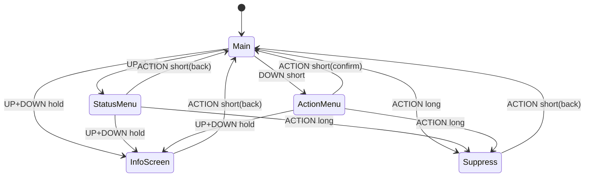

# ARCHITECTURE

## Layered model
1. **Config layer** (`include/config/*`) — пины, баланс, UI тайминги, app constants.
2. **Domain layer** (`include/domain`, `src/domain`) — чистая логика состояний/действий/мутаций.
3. **Game layer** (`include/game`, `src/game`) — tick pipeline, orchestration и интеграция сервисов.
4. **UI layer** (`include/ui`, `src/ui`) — UI model/FSM/render model.
5. **Platform/hardware layer** (`drivers`, `input`, `output`) — адаптеры железа.
6. **Storage layer** (`storage`) — NVS persistence + version guard.
7. **Diagnostics layer** (`utils/logger`) — уровневые логи.
8. **Telemetry layer** (`telemetry/*`) — event bus, recorder, replay hooks.

## Boundaries
- Domain не зависит от Arduino/ST7789/Preferences.
- GameEngine оркестрирует сервисы, но не знает деталей draw API.
- Input interpreter отделён от GPIO polling.
- Storage изолирован за `StateStorage` API.

## Tick flow

## Startup sequence

## UI state diagram

## Storage schema evolution
- Storage uses versioned envelopes and migration pipeline (v1->v2->v3).
- Recovery path emits telemetry and falls back to safe defaults when migration is unsupported.
