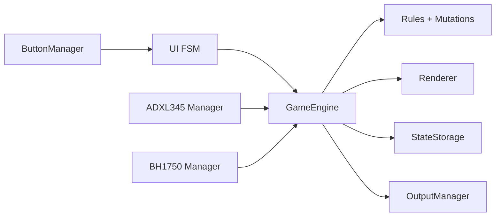
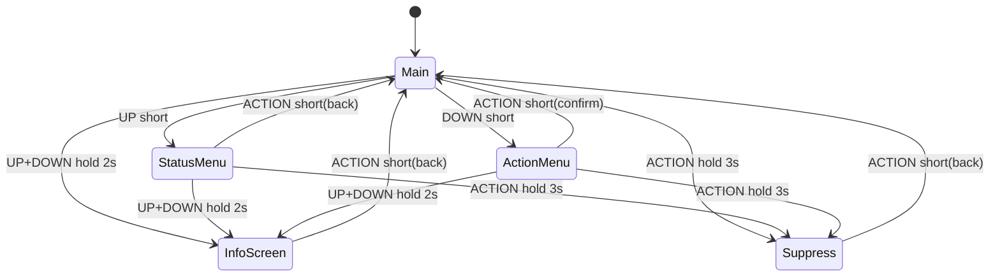
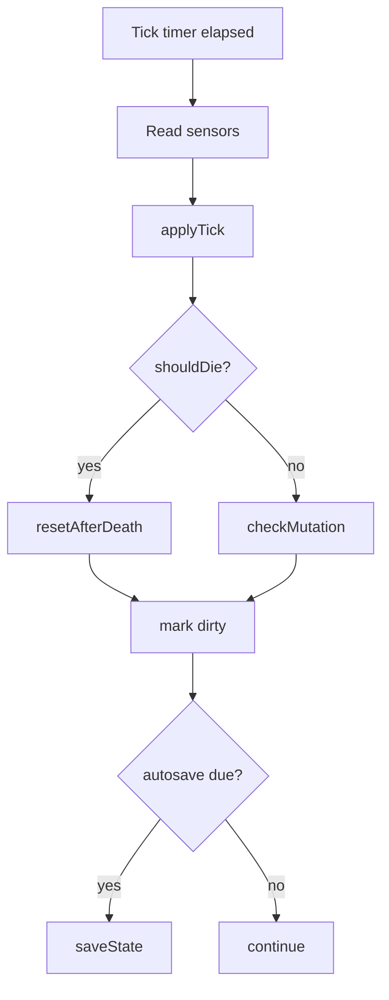

# ARCHITECTURE

## Модули
- `domain/`: чистая модель и правила изменения состояния.
- `game/`: orchestration тиков, применение правил, мутаций, автосохранения.
- `ui/`: FSM экранов и renderer.
- `input/`: кнопки, debounce/hold/combo.
- `drivers/`: ADXL345 и BH1750.
- `storage/`: NVS/Preferences.
- `output/`: buzzer/vibration.

## Поток данных
1. `ButtonManager` генерирует `InputEvent`.
2. `UiFsm` решает переходы/действия.
3. `GameEngine` применяет `applyAction`.
4. По tick-интервалу движок читает сенсоры и вызывает `processTick`.
5. `Renderer` рисует текущий UI/state.
6. `StateStorage` автосохраняет dirty-state.

## Игровой цикл
- Fast loop (~30 FPS): input -> fsm -> render.
- Tick loop (5s): sensor snapshot -> applyTick -> shouldDie/reset -> mutation checks.

## FSM переходы
- Main + UP short -> StatusMenu
- Main + DOWN short -> ActionMenu
- ActionMenu + UP/DOWN short -> смена action
- ActionMenu + ACTION short -> apply action + Main
- Status/Info/Suppress + ACTION short -> Main
- Любой экран + UP+DOWN hold 2s -> InfoScreen
- Любой экран + ACTION hold 3s -> Suppress + force Suppress action

## Разделение логики
- Platform-independent: `domain/*`, `game/rules`, `game/mutations`, `ui/ui_fsm`.
- Hardware-specific: `drivers/*`, `input/button_manager`, `storage/state_storage`, `ui/renderer`, `output/output_manager`.

## Mermaid: component

## Mermaid: state diagram

## Mermaid: tick processing flow

